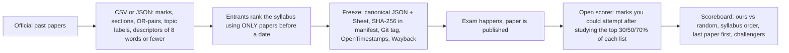

# KyaAayega

[](https://github.com/GarvitAgrawal04/KyaAayega/actions/workflows/verify.yml)
 

**An open scoreboard for exam priority lists.** From a university's *officially published* past papers it builds a one-page revision priority Sheet, freezes it before the exam, and scores it afterwards with an open script — against the shortcuts students already use. Every number is reproducible from a fresh clone.

> It is a priority order, never a promise of questions.

**Live demo:** `https://GarvitAgrawal04.github.io/KyaAayega/` · **Case study:** [docs/CASE-STUDY.md](docs/CASE-STUDY.md) · **Architecture:** [docs/ARCHITECTURE.md](docs/ARCHITECTURE.md)

## What is real today (read this first)

| Thing | Status |
|---|---|
| Entrants, choice-aware scorer, walk-forward backtest, freeze + hash verification, look-ahead test, CSV import, Sheet generator | **Real and tested** (25 tests) |
| Offline Time Machine (`web/index.html`) and the Sheet (`web/sheets/`) | **Real** — run from `file://`, no server |
| The corpus in `ledger/demo-univ/` | **SYNTHETIC**, generated by `scripts/make-synthetic.mjs` with a frequency signal built in. Scores on it prove the pipeline runs and *nothing else* |
| Real papers, real scores, real users | **None yet.** Nothing here may be quoted as a result until the synthetic corpus is replaced |

## Scoreboard

<!-- SCOREBOARD:START -->
_Mean marks coverage when studying only the top 50% of each list (by topic count), walk-forward. Generated by `kya readme` - do not edit by hand._

| Subject | Test sittings | B0 | B1 | B2 | B3 | C1 | C2 | Verdict |
|---|---|---|---|---|---|---|---|---|
| demo-univ/demo-os **(SYNTHETIC)** | 4 | 67.0% | 77.5% | 79.2% | 84.2% | 84.2% | 79.2% | unclear - proceed, say so publicly, let the live cycle speak |

B0 random · B1 syllabus order · B2 last paper first · **B3 ours: total past marks** · C1 recency challenger · C2 gap-aware challenger
<!-- SCOREBOARD:END -->

## Reproduce everything in three commands

```bash
npm ci
npm run verify     # types · frozen files match their hashes · no look-ahead · scoreboards reproduce · README is current · 25 tests
npm run demo       # then open web/index.html and web/sheets/*.html - works with wifi off
```

## How it works



1. **Corpus** — one file per past paper: sections, "attempt n of m", OR-pairs, marks, topic labels, and a neutral descriptor of **at most 8 words** per question. Verbatim question text is rejected by the schema. Enter data as JSON or as a spreadsheet (`kya import-csv`).
2. **Entrants** — every way of deciding what to revise first is a ranked list of syllabus topics: `B0` random · `B1` syllabus order · `B2` last paper first · **`B3` total past marks per topic (ours, no parameters)** · `C1` recency-weighted and `C2` gap-aware challengers with constants declared in code, never tuned on scored sittings.
3. **No look-ahead** — a list "as of 2024-12" may only use papers before 2024-12. One function (`before`) is the guard; tests delete all later papers and demand an identical list.
4. **Scoring** — study the top 30/50/70% of a list (by topic count: a proxy for effort, not a measure of it); a question counts only if *all* its topics were studied; choice rules are respected. Result: marks you could attempt ÷ paper maximum.
5. **Walk-forward** — every sitting after the first three is scored by lists built only from earlier sittings. Three honest verdicts: *obviously nothing*, *clearly something*, *unclear*.
6. **Freeze** — `kya freeze` writes the list and its Sheet, records both SHA-256 hashes, and refuses a second list for the same slot. `kya score-run` later scores the *frozen file*, never a recomputed one.

**Principle:** start with strong baselines, validate chronologically, and adopt a more complex method only when the evidence supports it.

## CLI

```
npm run kya -- validate   <univ/subject>
npm run kya -- import-csv <file.csv> <univ/subject>      # spreadsheet -> validated paper JSON
npm run kya -- export-csv <univ/subject>                 # corpus -> CSV (template / mapping review)
npm run kya -- rank       <univ/subject> --as-of 2024-12
npm run kya -- backtest   <univ/subject> [--write]
npm run kya -- sheet      <univ/subject> --as-of 2026-12
npm run kya -- freeze     <univ/subject> --as-of 2026-12 --status live|rehearsal
npm run kya -- score-run  <univ/subject> <run-name>
npm run kya -- readme [--check] · verify · build-web
```

## Find the right document

| You want to… | Read |
|---|---|
| Add real papers for a university | [docs/ADD-A-UNIVERSITY.md](docs/ADD-A-UNIVERSITY.md) |
| Understand the design and the code map | [docs/ARCHITECTURE.md](docs/ARCHITECTURE.md) |
| See the exact scoring rules | [PROTOCOL.md](PROTOCOL.md) |
| Know what the data is and is not | [docs/DATA-CARD.md](docs/DATA-CARD.md) · [PROVENANCE.md](PROVENANCE.md) |
| See why decisions were made | [docs/adr/](docs/adr/) |
| See related projects and what was borrowed | [docs/RESEARCH.md](docs/RESEARCH.md) |
| Read the full project blueprint | [docs/BLUEPRINT.md](docs/BLUEPRINT.md) |
| Read what was learned | [docs/CASE-STUDY.md](docs/CASE-STUDY.md) |

## Rules this repo keeps

- No verbatim question text, no PDFs, no papers of unknown origin.
- No invented evidence: no fabricated reviews, users or numbers. Every figure shown anywhere comes from a committed `scoreboard.json` or `scorecard.json`.
- Every frozen list gets scored and published, good or bad.

## Roadmap

- [x] Core engine, tests, offline demo, Sheet, CSV workflow, CI
- [ ] First real subject from an officially published question bank (4+ sittings) → first real scoreboard
- [ ] Second subject · deploy the demo to GitHub Pages
- [ ] First **live** freeze for an upcoming exam (tag + OpenTimestamps + Wayback) → first real scorecard when that paper is published
- [ ] Written case study with the honest numbers
- [ ] Optional: vision-LLM parsing helper, embedding-assisted mapping suggestions, Bloom-level tags, Hindi Sheet

## Licence

Code: MIT. Derived statistics in `ledger/`: CC BY 4.0. Exam papers remain the property of their universities and are not redistributed here.
