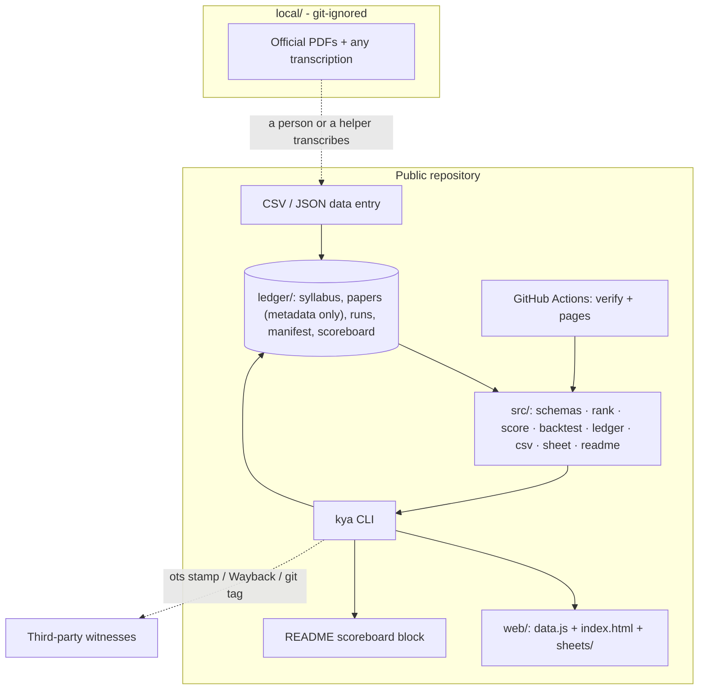
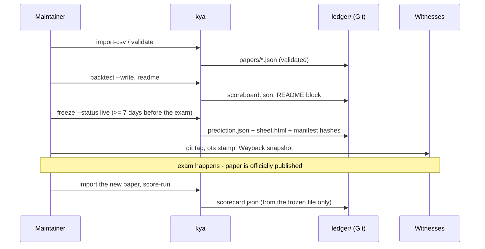

# Architecture

One writer (the CLI), plain files, pure functions, a static reader. No server, database, account or network call at run time.

## Modules

| File | Responsibility | Depends on |
|---|---|---|
| `src/schemas.ts` | Data shapes (zod), the 8-word descriptor guard, structural validation (sections must add up to `max_marks`) | zod |
| `src/rank.ts` | `before()` look-ahead guard, per-topic history, entrants B0-B3 and challengers C1-C2 | schemas |
| `src/score.ts` | Studied set, strict answerability, choice-aware and printed-marks coverage | schemas |
| `src/backtest.ts` | Walk-forward over sittings, summary, adversary selection, three-outcome verdict | rank, score |
| `src/ledger.ts` | Load + validate a subject, build the frozen artifact, freeze (hash manifest, one list per slot), verify hashes, look-ahead test, scoreboard reproduction, score a frozen run | all above |
| `src/csv.ts` | RFC-4180-style parser, corpus <-> CSV round trip | schemas |
| `src/sheet.ts` | The one-page Sheet as self-contained HTML with a verify code | canonical |
| `src/readme.ts` | Generates the README scoreboard block; staleness check | backtest |
| `src/cli.ts` | Argument parsing and I/O only - no logic | ledger and friends |
| `web/index.html` | Offline Time Machine, scoreboard, history map, ledger - reads `data.js` only | - |

## Data flow for one cycle

## Invariants (each has a test)

1. A list as of date D is identical when every paper on or after D is deleted.
2. Same corpus, same code -> byte-identical predictions, scoreboards and hashes.
3. A frozen file that changes by one byte fails `verify`; a second list for a frozen slot is refused.
4. Scorer fixtures are hand-computed (compulsory sections, attempt n of m, OR-pairs, multi-topic, out-of-syllabus).
5. Descriptors longer than 8 words are rejected - verbatim question text cannot enter the public data.
6. Corpus -> CSV -> corpus is lossless.
7. The README scoreboard equals a fresh computation, or CI fails.

## Extension points

- **A new entrant:** add a function `(papers, syllabus, asOf) => Ranking` to `ENTRANTS` in `src/rank.ts`, declare any constants in code, add a look-ahead test. It appears on every scoreboard automatically.
- **A new university or subject:** data only - see `docs/ADD-A-UNIVERSITY.md`.
- **A new metric:** add it beside `coverageChoiceAware`, record it in `PROTOCOL.md` as a new protocol version; frozen runs keep the version they were frozen under.
