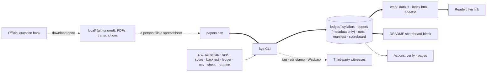

# KyaAayega — Portfolio Repository Blueprint (v7)

*Produced by running the Domination Engine v3 on blueprint v6, the external review of it, and a fresh survey of related GitHub repositories (**20 Sep 2026**). Standalone: assumes zero prior context. External claims are labeled **Verified** (checked at source this round), **Reported** (secondary source or carried from an earlier round), **Inferred**, **Stated** (told by the author) or **Unknown `[VERIFY]`**. Numbers that are not evidence-backed are *proposed targets* or *estimates*. Result numbers are placeholders in [BRACKETS]: they are produced by running the code on real papers, never typed. Nothing here is legal advice.*

**Purpose, as now stated by the author:** a general-purpose GitHub repository for a résumé — solo, self-paced. **Capacity carried from v5:** ~1–3 h/week; this plan assumes 2. No hackathon defaults are applied; every hour-by-hour sprint, team role and judge drill from v6 is removed.

**What already exists (repo v0.2.0, built and tested 20 Sep 2026):** a TypeScript repository of ~1,000 lines (source, tests, scripts and the demo page) with **25 passing tests**: data schemas with structural validation and a guard against verbatim question text · six ranking "entrants" behind one look-ahead guard · a choice-aware scorer with hand-computed fixtures · a walk-forward backtest with a three-outcome verdict · freeze with a hash manifest that refuses a second list per slot · scoring of the frozen file · CSV import/export with a lossless round-trip test · a one-page Sheet generator · an offline Time-Machine page with scoreboard, history map and ledger · a README scoreboard generated between markers with a CI staleness check · JSON Schemas · decision records, data card, contributor guide, case-study template · CI (`verify`) and a GitHub Pages workflow. From a fresh copy, install + verify took seconds. **What does not exist:** any real paper, any real score, any real user. The bundled corpus is synthetic and says so everywhere.

---

## 1. The Verdict

The concept from v6 — Time Machine, open Scoreboard, Live Freeze, on officially published papers — **survives untouched; its packaging was wrong for the purpose** (*structurally suboptimal, rebuilt as follows*). A résumé project is not judged in a room in ninety seconds; it is judged by a recruiter skimming a README for a minute and by an engineer who may clone it, so stage logistics are replaced by three deliverables: **a deployed link, a README that proves itself, and a short written case study with honest numbers.** The plan is re-platformed from a sprint clock onto calendar weeks at ~2 h/week, and because the engine is already built and tested, almost all remaining hours go to the only thing that is missing — real data and one real commitment. A survey of fifteen-plus related repositories found many "upload papers → AI analysis" projects and **none that freezes a list, compares itself with simple baselines, or publishes a reproducible score** (not found ≠ absent), so the differentiator for a reader is evaluation rigour, not features. This wins despite the method being plain counting and despite the real possibility of an unflattering result, because a small project that can be checked end to end says more about an engineer than a large one that cannot.

**Component Disposition (v6 → v7):**

| v6 component | Disposition | One-line reason |
|---|---|---|
| Time Machine · Scoreboard · Live Freeze | **KEEP** | Works cold in a README, a link or a two-minute recording exactly as well as live |
| 24 h / 72 h / 2-week scope ladder, team roles, hour-by-hour schedule | **REMOVE** | An invented clock for a solo, self-paced project; replaced by weeks at ~2 h/week |
| Judge Q&A drill, wifi-off rehearsal, backup recording | **REPLACE** | → interview talking points, a deployed URL, a 2-minute screen recording linked from the README |
| Written case study (a 2-week add-on in v6) | **IMPROVE → top-three deliverable** | It is what a technical reader actually reads |
| ~1–3 h/week capacity (dropped by v6) | **RESTORE** | Ground truth from v5 |
| Official public corpus (UPES library question bank) + source rule | **KEEP** | Verified 20 Sep 2026; holds under any framing |
| Quarantine of the simulated reviews; no-invented-evidence rule | **KEEP** | A planted testimonial is a worse interview discovery than a modest result |
| Core engine, CI auditor, Sheet, offline demo | **KEEP — now built** | v0.2.0, 25 tests |
| Recency + shrinkage candidate | **IMPROVE — built as challengers C1 (recency) and C2 (gap-aware)** | Constants declared in code; must beat plain counting on real data to ship |
| LLM-guess entrant | **DEFER** | Needs an API key and a cached, committed list to keep CI deterministic; an extension point, not a blocker |
| Data entry by vision-LLM parsing first | **REPLACE → CSV first** | Borrowed from related repos; the bottleneck is data entry, and a spreadsheet needs no key, no prompt and no debugging |
| Hallway comprehension test | **KEEP (5 real students)** | Cheap, real, and a paragraph in the case study |
| v5 startup roadmap (launch university, reps, recall experiment) | **DEFER** | "Potential", stated in the README roadmap — not built |

## 2. Context & Constraints

**Project type:** open-source portfolio project. Winning = a stranger understands it in a minute, can verify it in five, and finds the engineering choices defensible. **Team:** one student. **Capacity:** ~2 h/week (range 1–3), near zero during his own exams. **Budget:** ₹0; an optional LLM helper would cost a few dollars at most *(estimate)*. **Evaluation audience, and how each actually evaluates** (Inferred): a recruiter — README top, live link, pinned-repo blurb, ~60 seconds; an interviewing engineer — README, case study, tests, commit history, maybe a clone, 5–15 minutes; a fellow student or contributor — can I add my university.

| Constraint | Class | Notes |
|---|---|---|
| **Source rule:** only papers an institution publishes itself, or lets candidates keep; one provenance line per paper; unknown origin = not used. Nothing from Chandigarh University (papers are collected — Stated; generated from question banks — Verified, cuchd.in, 20 Sep 2026) | **Hard** | `PROVENANCE.md` |
| **No invented evidence** — no fabricated reviews, users or numbers anywhere, including the résumé line | **Hard** | Every figure is copied from a committed `scoreboard.json` / `scorecard.json` |
| No verbatim question text or PDFs in the public repo | **Hard** | Enforced by schema (descriptors ≤ 8 words) and `.gitignore` |
| Every published number reproduces from a fresh clone | **Hard** | `npm run verify` in CI |
| Synthetic data is labelled wherever it appears | **Hard** | Flag in data → banner on the page, watermark on the Sheet, tag in the README table |
| A live list is frozen ≥ 7 days before its exam and is always scored | **Hard** | The credibility mechanism |
| Zero personal data | **Hard (by design)** | No accounts, forms or cookies |
| Free tiers only | **Soft** | No need to break it |
| TypeScript, static hosting | **Preference** | Skill fit; already built |

**Real corpus — Verified.** The UPES library publishes previous end-semester papers with direct download links (library.ddn.upes.ac.in question bank, fetched 20 Sep 2026). Sittings visible for B.Tech CSE: Operating Systems — 7 (Dec 2017 → Dec 2024); Design and Analysis of Algorithms — 6+ (Dec 2019 → Dec 2024, and Dec 2018 on a sibling page); Discrete Mathematics, OOP, Software Engineering, Compiler Design — 5–7 each. Caveats: course codes change across years; "SET-01/SET-02" in file names means several sets exist; terms of use unchecked `[VERIFY]`; download once, politely; never redistribute.

## 3. The Problem

**Stated:** students don't know what to revise first the night before a paper. **Root:** they have many signals — a senior's PDF, a guidebook's "important questions", conflicting lists in the class group, apps quoting an accuracy figure — and no way to know which deserves trust, because none has ever been scored against what was asked. The missing thing is a **scoreboard**, not another predictor.

**A second, equally real problem this repository solves — for its author:** most student projects in this space cannot be evaluated by a reader either. They show a UI and a claim. A reader cannot tell whether the method works, whether the numbers are real, or whether the author understands evaluation. The repository is designed so that *its own quality is checkable*, which is the portfolio signal.

**Users and incumbent workflows.** *Students:* open the forwarded list, glance at last year's paper, guess (Stated by the author; Reported for several universities, 19 Sep 2026). *Repo readers:* skim the README, click a demo link if one exists, look for tests and a story.

**Pain points, frequency × severity:** (1) what do I revise first tonight — every paper, high; (2) which list do I trust — every paper, high; (3) counting eight PDFs by hand — every paper, medium; (4) for readers: "is this real or a tutorial clone?" — every repo visit, high.

**Measurable success for a portfolio repository:** real scoreboards for ≥ 2 subjects from an official source · one **live** freeze with hash, tag, timestamp proof and snapshot · a deployed demo URL · a case study of ≤ 600 words with real numbers · clone → verified in < 5 minutes on a stranger's machine · ≥ 4 of 5 real students explain the Sheet correctly · stretch: one outside contributor adds a subject.

**Assumptions, classified:**

| Assumption | Status | Reasoning |
|---|---|---|
| Counting past marks per topic beats "start from last year's paper" | **Unknown** | The scoreboard answers it; either answer is publishable |
| Readers reward rigour and honesty over feature count | **Inferred** | True of the readers worth impressing; the README is built to make rigour visible fast |
| An official corpus with enough history exists | **Confirmed** | Verified 20 Sep 2026 |
| Manual CSV entry is fast enough (~25 min per paper) | **Questionable** | Measured on the first four papers; a parsing helper is the fallback |
| Students read "asked in 6 of 8 papers" correctly | **Inferred** | Five real students, week 9 |
| The supplied 250 star-rated "reviews" are evidence | **Rejected** | They describe artifacts that did not exist; hypothesis list only |
| "Take every good feature of every related repo" makes the project stronger | **Rejected as stated** | It makes it larger. Every feature found is *considered* (§7.5); only those that serve the scoreboard are built |

**Hidden requirements and edge cases:** course-code churn; multiple sets per sitting; OR-pairs and sub-parts; two-topic questions; syllabus revisions across seven years; the topic list must be fixed before held-out papers are opened; repository hygiene (no keys, no PDFs); the author's name is on it — integrity lapses are permanent.

## 4. The Landscape

### 4.1 Related GitHub repositories (surveyed 20 Sep 2026 via the GitHub search API and each README; stars as seen that day)

| Repository | ★ | What it does | Strength worth borrowing | Gap |
|---|---|---|---|---|
| Anand-1812/pyq-analyzer | 1 | Syllabus + papers → embedding-based topic mapping; forecast from frequency, year coverage, recency; boosts 2–3-year recurrences; clusters similar questions; CLI + Streamlit | Clean module layout; recency and recurrence-gap ideas | No evaluation of its forecasts |
| AdwaithSaiju/mimir (KTU) | 2 | Drop-in CSV per subject; scores by frequency, gaps, marks | **CSV as the entry format**; `question_type` | Unfinished; unevaluated |
| M0ON-W/exam-paper-analyzer | 2 | Analyses digitised question banks; importance with source location (paper, question, page); states no hidden formula, no guarantee | **Traceability; honest stance** | No scoring against outcomes |
| bhagyashreebhamagod/examgenie-smart-analyzer | 0 | FastAPI + Next.js; OCR with page numbers; classification with confidence; repeated / never-asked / new topics; heatmaps; exports | **History heatmap, never-asked list**, exports | Heavy stack; no evaluation |
| Ayushhgit/ExamRAG | 3 | Extraction; question-type rules + LLM fallback; Bloom levels; repeat clustering; predictor; mock exams, answer keys, planner, RAG practice | Rules-first-then-LLM; type and Bloom tags | Feature sprawl; claims unverified |
| krish902/question-paper-difficulty-analyzer | 3 | BERT Bloom-level classifier, 3,510 questions; reports 98.52% validation accuracy (its claim); two conference papers | Bloom tags for a paper-quality report | Different task |
| asimpathan1509-cmyk/ai-exam-gap-analyzer | 2 | Syllabus + PYQ trends + student performance → what to study | Personal-gap idea | Needs personal data |
| mahivram/Paper_Analyzer · naakaarafr/…-Analyzer · hitesh111630/Paper_Analysis_AI · sujaldwivedi601-ctrl/analytic_app | 0–3 | Upload → LLM lists common topics / chat / answers | — | Proves the calculation is a commodity |
| Karthikg1908/Vtu-Question-Papers-Hub · VAIBHAVBABELE/vaibhavbabele.github.io | 11 · 47 | Paper archives / student hubs on GitHub Pages | Contribution-friendly structure | No analysis |
| **mverab/WorldCupBench** | 14 | LLM predictions **frozen before kick-off, scored live**; leaderboard injected into the README; JSON-Schema-validated predictions; freeze provenance | **The closest structural analogue**: README leaderboard markers, schemas, provenance fields | Different domain |
| opentimestamps/opentimestamps-client · javascript-opentimestamps | 418 · 150 | Bitcoin-anchored timestamp proofs (JS library last pushed Mar 2023) | Third-party witness | JS port stale → use the Python client |
| letsseal/letsseal | 371 | Open standard for sealing files | Possible second witness `[VERIFY]` | Not evaluated yet |
| sauravsingla/Time_Series · zachisit/july-backtester | 7 · 10 | Leakage-safe walk-forward benchmarks; point-in-time data | The principle; the docs-index table; the point-in-time idea | Different domain |
| awesome-readme · Best-README-Template · Documentation-Compendium · ADR repos (MADR, adr-tools) | 21.5k · 16.4k · 6.0k · 2.5k–17k | README and decision-record craft | Structure of README and `docs/adr/` | — |

### 4.2 Products (carried, 19–20 Sep 2026)

Forwarded important-question lists and guidebooks — the real competitor for students: instant, trusted, never scored (Reported). Official question banks and archive sites — free raw papers, zero analysis (Verified). ANALYXX AI — advertises a 94% accuracy figure, method not found; ₹449/month Pro (Verified, product page). Gyani AI, upload predictors (Solvely, MCQForge, PredictExam.ai, AI Exam Analyzer, Brigo), per-university PYQ apps (PyqSpot, VTU Sync) — analysis without any public scoring found (Verified).

**Synthesis.** On GitHub the space is crowded with small "upload papers → AI summary" projects, nearly all with 0–3 stars, none of which was found to evaluate itself; in the market, the currency is the unverifiable accuracy number. What exists and is done well: extraction pipelines, topic mapping by embeddings or LLM, heatmaps, exports. Where everything fails: nobody commits to a list in advance, compares with the shortcuts students already use, or lets a stranger reproduce a score. What nobody does well enough is **evaluation** — and evaluation discipline is also exactly what a hiring engineer looks for. One design decision — *make the scoreboard the product* — closes both gaps.

## 5. The Solution

**Pitch.** KyaAayega is an open scoreboard for exam priority lists. From a university's officially published past papers it builds a one-page Sheet — each topic with its history, "asked in 6 of the last 8 papers, usually 10 marks" — freezes it in a public repository with third-party timestamps before the exam, and afterwards scores it with an open script against last-year's-paper, syllabus order, a random pick and two declared challengers. Every score is published, good or bad, and reproduces from a fresh clone. It is a priority order, never a promise of questions.

**Core loop:** official papers → spreadsheet (`import-csv`) → validated JSON → entrants rank the syllabus *as of* a date → walk-forward scoreboard → **freeze** (list + Sheet, hashes, tag, timestamp, snapshot) → exam → paper published → **score the frozen file** → scoreboard and README update → case study.

**The three reader-facing surfaces, all generated from the same JSON:** **Time Machine** (pick a past exam; see the list exactly as it stood beforehand; *Reveal* the real paper, lit rows and entrant bars) · **Scoreboard** (every entrant × every exam, losses at the same size as wins; mirrored in the README) · **Ledger** (frozen runs with hashes; the live one for an exam that hasn't happened).

**Vertical slice.** *M0 — done (20 Sep 2026):* the whole path on synthetic data — CSV/JSON → rank → backtest → freeze → Sheet → page → verify. *M0-real — the first milestone of the plan:* the same path on **four real sittings of one subject**, ending in the first real Reveal. Everything after that is widening, not integrating.

## 6. Why This Wins

**Structural advantages (each traces to a design decision):**
1. **It evaluates itself.** Walk-forward replay, declared baselines, a verdict that can say "unclear" or "obviously nothing". Not found in any related repo.
2. **It cannot fool its author.** One look-ahead guard with a test; a parameter-free primary method; challengers with constants fixed in code.
3. **It can be checked by a stranger in minutes.** `npm ci && npm run verify` re-derives every hash and score; CI shows it; the README table is generated, not typed.
4. **It makes a public commitment.** A live list, frozen and timestamped before the exam — falsifiable after the README is written.
5. **Clean inputs by rule.** Official sources, provenance log, no redistributed text.
6. **Boring by design.** Pure functions, plain files, static page; nothing to host, leak or pay for.
7. **An extension surface.** A new university is data only; a new entrant is one function; both are documented.

**What a reader learns about the author in 60 seconds:** can frame a problem; knows what leakage and baselines are; writes tests that mean something (hand-computed fixtures, tamper test); documents decisions; tells the truth about limits. That is the résumé value — not the domain.

**Data advantage.** *Generated:* reviewed question→topic corpora with provenance; frozen-list ↔ outcome pairs; mapping corrections. *Improves the product:* outcome pairs decide whether a challenger replaces plain counting. *How others get it:* papers — trivially; mappings — labour; outcome pairs — only by living through sittings. *What prevents replication:* the calendar. Nothing else.

**Moat Ladder (honest):** **L1–L2.** This is a portfolio project; the point is the signal it sends, and no moat is claimed.

**Domination Scorecard — against the typical related repository (from the 20 Sep survey):**

| Dimension | Typical PYQ-analysis repo | Best found | KyaAayega v0.2.0 | Evidence |
|---|---|---|---|---|
| Evaluates its own output | No | No (not found) | Walk-forward vs 3 baselines + 2 challengers | `src/backtest.ts`, tests |
| Guard against look-ahead | n/a | Present in finance/time-series benchmarks | One guard + test per entrant | `before()`, tests |
| Reproducible numbers | No | WorldCupBench: schema-validated, frozen | CI re-derives hashes and scores; README generated | `verify.yml` |
| Public pre-commitment | No | WorldCupBench (freeze before kick-off) | Hash manifest + tag + OpenTimestamps + Wayback; one list per slot | `freezeRun` |
| Tests | Rare | Some | 25, incl. hand-computed fixtures and a tamper test | `test/` |
| Data provenance | Unknown uploads | Page-level traceability (exam-paper-analyzer) | Official-source rule + provenance log + page field | `PROVENANCE.md` |
| Time-to-Value for a reader | Read code to guess | Good README | README → live link → 3-command verify | README |
| Data entry barrier | PDF upload + API key | CSV (mimir) | CSV template + validation that catches structural errors | `import-csv` |
| Honest labelling | Rare | exam-paper-analyzer's no-guarantee stance | Synthetic flags everywhere; blanks instead of numbers | README, Sheet |

## 7. Feature Set

Contract format: *what it does · done-when · the test that proves it.* ✅ = built in v0.2.0. Thresholds are *proposed targets*. ★ = the three differentiators.

**Must-Have:**

| # | Feature | Done-when | Test | State |
|---|---|---|---|---|
| F1 | **Schemas + structural validation** — zod shapes; descriptors ≤ 8 words; sections must match `of` and add up to `max_marks`; unknown topics rejected | A malformed paper cannot be loaded | Schema tests; 9-word descriptor rejected | ✅ |
| F2 | **CSV data entry** — `import-csv` / `export-csv`; one row per question; section rules repeated per row and checked for conflicts | A spreadsheet becomes validated paper files in one command | Lossless corpus→CSV→corpus round trip; conflicting rows rejected | ✅ |
| F3 | **Entrants behind one look-ahead guard** — B0 random (seeded), B1 syllabus order, B2 last-paper-first, **B3 total past marks (ours)**, C1 recency (λ = 0.85 declared), C2 gap-aware (×1.25 due, ×0.8 just-asked, declared) | Same corpus → identical lists; nothing on or after the date can influence a list | Determinism; per-entrant "delete later papers → identical list" test; hand-computed B3 ordering | ✅ |
| ★F4 | **Choice-aware open scorer** — strict answerability; attempt-n-of-m; OR-pairs; out-of-syllabus stays in the maximum; printed-marks fallback | Runs on public JSON only | 5 hand-computed fixtures + fallback check | ✅ |
| ★F5 | **Walk-forward scoreboard + verdict** — every sitting after the third; mean/median/worst; adversary = better of B1/B2; verdicts *insufficient / obviously nothing / clearly something / unclear* | `scoreboard.json` reproduces byte-for-byte | Reproduction test; bounds test | ✅ |
| ★F6 | **Freeze + verify + score-run** — canonical JSON + Sheet; SHA-256 manifest; one list per slot; scoring reads the frozen file only | A changed byte fails `verify`; a second freeze is refused; scoring before the paper exists is refused | Tamper test; slot test; frozen-score equals walk-forward number | ✅ |
| F7 | **The Sheet** — self-contained HTML, 1080 px: ≤ 12 topics, a dot per past paper, n/N, typical marks, last asked, ranking rule, depth label in words, fixed line *"Priority order, not guaranteed questions"*, verify code, SAMPLE/REHEARSAL watermarks | One command; screenshot or print | Row cap, watermarks, verify code, banned-phrase test ("will come") | ✅ |
| F8 | **Offline Time Machine** — Reveal, entrant bars, scoreboard, history map, never-asked topics, ledger; synthetic banner | Works from `file://` | Simulated-DOM smoke run (render, Reveal, switch sitting, zero script errors); **manual browser check still owed** | ✅ / check |
| F9 | **Generated README scoreboard + CI auditor** — table between markers; `readme --check`; `verify` = types + hashes + look-ahead + reproduction + README + tests | CI red when anything drifts | Staleness test; CI workflow | ✅ |
| F10 | **Real corpus, subject 1** — Operating Systems, ≥ 4 then all 7 sittings, provenance lines, syllabus fixed first | `validate` green; synthetic flag gone for this subject | Second-pass check of marks/sections on every paper; one paper re-entered blind to measure entry error | ☐ |
| F11 | **Real corpus, subject 2** — Design and Analysis of Algorithms | Same | Same | ☐ |
| F12 | **Deployed demo + 2-minute recording** — GitHub Pages workflow (exists) switched on; recording linked from the README | Public URL loads the Time Machine with real data | Open on a phone and a laptop | ☐ |
| F13 | **One live freeze** — next sitting of subject 1: freeze ≥ 7 days ahead → Git tag → `ots stamp` → Wayback snapshot → URLs recorded in the manifest | Proof files committed; README ledger shows LIVE | `ots verify` (or an honest "pending"); tamper test | ☐ |
| F14 | **Case study (≤ 600 words)** — problem, approach, data, honest numbers, what surprised me, what I'd change | Every number traces to a committed JSON | A friend finds no claim without a source | ☐ |

**High-Impact Differentiators (3):** ★F5 the self-evaluating scoreboard · ★F6 the freeze that binds the author · ★F4 a scorer that respects how papers are actually attempted.

**Nice-to-Have (only after F10–F14):** external entrants from a committed JSON list (e.g. a cached LLM guess, or a dated real important-questions list compared at equal topic count) · vision-LLM parsing helper that writes the CSV (rules first, LLM fallback, page numbers kept) · embedding-assisted mapping suggestions · Bloom-level tags and a repetition/quality report for faculty · search/filter and CSV export on the page · a local-only "I've revised this" checklist · Hindi Sheet · coverage badge, lint, release workflow, devcontainer · a PNG renderer for the Sheet.

**Future (explicitly not now):** everything in the v5 startup plan — a launch university chosen by where a real contact exists, reps and distribution, the private recall experiment for universities that collect papers, accounts and any personalised feature.

### 7.5 Feature harvest — every good idea found in related repos, and its fate

| Idea | Seen in | Decision | Why |
|---|---|---|---|
| CSV as the contributor format | mimir, exam-paper-analyzer | **Adopted ✅** | Removes the data-entry barrier — the real bottleneck |
| Traceability to paper, question, page | exam-paper-analyzer, examgenie | **Adopted ✅** (`number`, `page`, `source_url`) | Every public fact points to its official source |
| "No hidden formula, no guarantee" stance | exam-paper-analyzer | **Adopted ✅** | Matches the fixed priority line |
| Question-type and Bloom-level tags | ExamRAG, krish902 | **Adopted ✅ as optional fields**; classifier later | Cheap metadata; powers a faculty report later |
| Recency weighting; recurrence-gap boost | pyq-analyzer, mimir | **Adopted ✅ as challengers C1/C2** | Good ideas get a fair trial, not a free pass |
| README leaderboard between markers | WorldCupBench | **Adopted ✅** + CI staleness check | Numbers are generated, never typed |
| JSON-Schema-validated data; freeze provenance fields | WorldCupBench | **Adopted ✅** (`schema/`, run metadata) | Language-agnostic validation |
| Topic × year heatmap; never-asked topics | examgenie | **Adopted ✅** (history map) | One table, high information |
| "Strong baselines first… complexity only with evidence"; docs index table | Time_Series | **Adopted ✅** | The project's creed; README navigation |
| Point-in-time data discipline | july-backtester | **Adopted ✅** (`before()` + tests) | The core integrity guarantee |
| Decision records; README structure | MADR, adr-tools, Best-README-Template | **Adopted ✅** | Shows reasoning, not just code |
| OCR / vision parsing with page numbers | examgenie, ExamRAG | **Later** | Useful once CSV entry proves too slow; rules first, LLM fallback |
| Embedding-based topic mapping | pyq-analyzer | **Later, as suggestions only** | Human-reviewed labels stay authoritative |
| Near-duplicate question clustering | ExamRAG, examgenie | **Later, private only** | Needs verbatim text, which never becomes public |
| Search, filters, exports, dark mode | examgenie | **Later** | Polish after real data |
| Personal gap analysis | ai-exam-gap-analyzer | **Later, local-only checklist** | No accounts, no personal data |
| Bilingual README | WorldCupBench | **Later** (Hindi Sheet first) | Audience fit |
| Brier score / calibration | WorldCupBench | **Later** | Only when lists carry probabilities |
| Native JS timestamping | javascript-opentimestamps | **Rejected for now** | Library last pushed Mar 2023; use the maintained Python client |
| A second sealing standard | letsseal | **`[VERIFY]` later** | One witness more, if it is sound |
| Mock-exam generator, answer keys, tutor/RAG chat, study planner, concept graph | ExamRAG and others | **Rejected** | Unverifiable output; off-thesis; feature sprawl |
| Upload-your-PDF web service | several | **Rejected** | Unknown provenance, copyright, a server to run |
| Accuracy-percentage headline | market apps | **Rejected** | The thing this project exists to counter |
| IRT psychometrics | gaokao-analyzer | **Rejected** | Needs student response data |

## 8. What We Will NOT Build

**Kill list:** accounts, database, backend, payments · chatbot, tutor, RAG, mock exams, answer keys, planners · mobile app, PWA, bots · ML models, fine-tuning, embeddings as the primary method · any live API call on the demo path · anything using papers of unknown origin or from a university that collects its papers · verbatim questions or PDFs in the repo · fabricated reviews, testimonials, user counts or results · an accuracy headline.

**The three things this author is most likely to waste time on — forbidden until F10 is done:**
1. **Another version of this document, or another review of it.** Seven versions exist; zero real papers are entered. The next artifact is a CSV.
2. **Harvesting more features.** The table above is the harvest. Building from the "Later" column before real data exists makes the repo bigger and the evidence no better.
3. **Tuning or polishing on synthetic data.** Any number or visual refined against the generated corpus is decoration.

## 9. Decision Log

Options × User Value / Differentiation / Feasibility / Cost / Risk / Defensibility (H/M/L + confidence); decided by trade-off reasoning, never averaging.

**Decision 1 — What the project is.**

| Option | UV | Diff | Feas | Cost | Risk | Def | Conf. |
|---|---|---|---|---|---|---|---|
| A. v6 hackathon blueprint, unchanged | M | H | L for a solo, self-paced author | L | H — invented deadline; effort spent on stage craft nobody will see | — | High |
| **B. Evaluation-first portfolio repository** — engine built, real data next, live freeze, case study | H | **H** (no comparable repo found) | **H** (~25 h left) | ₹0 | M — modest numbers | M | High |
| C. Reframe as a generic "frozen-prediction benchmark toolkit" library | M | M | M — abstraction before a second use case | L | M — a framework with one user reads as over-engineering | M | Med |

**Verdict: B, absorbing C's two extension points** (entrant = one function; university = data only). B wins despite its narrow domain because a concrete, finished, checkable project beats a general, unfinished one on a résumé. *Effects:* first-order — hours go to data; second-order — the repo doubles as a teaching example of leakage-safe evaluation; negative externality — a weak result is public under the author's name (it is also the honest talking point); long-term — the same code runs real cycles if the startup idea returns. *Reversibility:* **Reversible.**

**Decision 2 — Stack.**

| Option | UV | Diff | Feas | Cost | Risk | Def | Conf. |
|---|---|---|---|---|---|---|---|
| **TypeScript CLI + plain files + static page** | H | M | **H — already built, 25 tests** | ₹0 | L | — | High |
| Python + Streamlit (the norm among related repos) | M | L | M — rewrite | ₹0 | M — needs a running server for a demo link | — | Med |
| Next.js + Supabase full stack | M | L | M | ₹0 | H — auth, DB and uptime for no user benefit | — | High |

**Verdict: keep the TypeScript/static design.** Wins despite Python being the data-science default because a static demo is never down and the repo shows engineering range beyond notebooks. *Reversibility:* **Reversible** (data is language-neutral JSON with published JSON Schemas).

**Decision 3 — How real papers get in.**

| Option | UV | Diff | Feas | Cost | Risk | Def | Conf. |
|---|---|---|---|---|---|---|---|
| Vision-LLM parsing first | M | M | M — key, prompts, debugging structure errors | $ | H — silent marks/section errors; more code before any data | — | Med |
| **Spreadsheet entry first (`import-csv`), with validation** | H | M | **H — built; ~25 min per paper *(estimate)*** | ₹0 | L–M — tedium; entry mistakes (caught by structural checks + a second pass) | — | Med-High |
| Both from the start | M | M | L at 2 h/week | $ | M | — | Med |

**Verdict: CSV first.** Wins despite being manual because ~14 papers is ~6 hours, the validator catches structural mistakes, and nothing else stands between the project and real numbers. The parsing helper becomes worth building only if a third subject is added. *Reversibility:* **Reversible.**

**Decision 4 — Cleverer methods.**

| Option | UV | Diff | Feas | Cost | Risk | Def | Conf. |
|---|---|---|---|---|---|---|---|
| Ship a tuned recency/gap model as "ours" | M | L (everyone does) | H | L | **H — tuned on the sittings it is scored on; indefensible in an interview** | L | High |
| **Parameter-free primary; declared challengers on the same scoreboard; promotion rule in `PROTOCOL.md`** | H | H | H — built | L | L — ours may lose to a challenger (fine: it's recorded) | M | High |

**Verdict: the second.** *Effects:* the scoreboard itself answers "why not ML?" *Reversibility:* **Reversible** by protocol version; frozen runs keep theirs.

**Decision 5 — Proof depth.**

| Option | UV | Diff | Feas | Cost | Risk | Def | Conf. |
|---|---|---|---|---|---|---|---|
| None | L | L | H | 0 | H — "you could have edited it" is unanswerable | L | High |
| **Hash manifest + Git tag + OpenTimestamps + Wayback** | H | H | H (~1.5 h once) | ₹0 | L — confirmation latency; few will verify | M | High |
| Add a sealing standard / signed commits now | M | M | M | hours | M — unverified tooling, invisible to readers | M | Low |

**Verdict: the middle option**, with signed commits and a second witness parked under `[VERIFY]`. A frozen run is a deliberate **one-way door**; everything around it is Reversible.

## 10. Build / Buy / Integrate

| Subsystem | Decision | Justification | Reversibility |
|---|---|---|---|
| Auth, database, backend, payments, notifications, analytics | **None** | Nothing to log into, store, sell or track | — |
| Data store | **Build** — JSON in Git, zod schemas, exported JSON Schemas | Diffable, reproducible, language-neutral | IDs Moderate |
| Data entry | **Buy** — any spreadsheet → CSV | Zero build beyond the importer | Reversible |
| Rankers, scorer, backtest, freeze | **Build** | The contribution; ~500 lines of pure functions | Reversible |
| Timestamp proof | **Open source** — OpenTimestamps Python client (Verified active, 20 Sep 2026) | Free, offline-verifiable | Reversible |
| Snapshot | **Integrate** — Wayback "Save Page Now" `[VERIFY]` | Independent witness | Reversible |
| Hosting | **Managed** — GitHub Pages (workflow exists) | Free, tied to the repo | Reversible |
| CI | **Managed** — GitHub Actions `[VERIFY free minutes]` | The auditor badge | Reversible |
| Tests | **Open source** — vitest | Already in place | Reversible |
| Parsing helper (later) | **Buy** — one hosted vision model behind a single file, output = CSV | Labour saver only; never on the scoring path | Reversible |
| Sheet image | **Manual** screenshot / print-to-PDF now; Playwright later | No browser dependency in CI | Reversible |

## 11. Technical Architecture

Candidates compared in Decision 2. The chosen architecture — one writer, plain files, pure functions, a static reader — wins on failure modes, cost and reviewability.

### 11.1 System overview



Thick arrows = the vertical slice. The CLI is the only writer; `local/` holds everything copyrightable; the ledger holds derived data and proofs; the page and README only read.

### 11.2 Repository layout
```
README.md · PROTOCOL.md · PROVENANCE.md · CHANGELOG.md · CONTRIBUTING.md · SECURITY.md · CODE_OF_CONDUCT.md · CITATION.cff · LICENSE
src/        schemas.ts · canonical.ts · rank.ts · score.ts · backtest.ts · ledger.ts · csv.ts · sheet.ts · readme.ts · cli.ts
test/       score · rank · ledger · features   (25 tests)
ledger/     manifest.json · <univ>/<subject>/{syllabus.json, papers/YYYY-MM.json, scoreboard.json, runs/<as-of>-<status>/{prediction.json, sheet.html, scorecard.json}}
schema/     paper.schema.json · syllabus.schema.json      (generated)
web/        index.html · data.js (generated) · sheets/
docs/       BLUEPRINT · ARCHITECTURE · RESEARCH · ADD-A-UNIVERSITY · DATA-CARD · CASE-STUDY · adr/0001–0006 · templates/paper-template.csv
scripts/    make-synthetic.mjs · export-schemas.ts
.github/    workflows/{verify,pages}.yml · ISSUE_TEMPLATE/{new-university, challenge-a-mapping, bug} · PULL_REQUEST_TEMPLATE.md
local/      git-ignored
```

### 11.3 Data model
- **syllabus** `{university, subject, title, fixed_on, units[] {id, name, topics[] {id, name, aliases[]}}}`
- **paper** `{id, university, subject, sitting "YYYY-MM", course_code, set?, max_marks, source_url, synthetic, sections[] {id, attempt, of}, questions[]}`
- **question** `{id, section, number, marks, or_group?, descriptor (≤ 8 words), topic_ids[] (reviewed; empty = out of syllabus), topic_ids_machine[]?, question_type?, bloom?, page?}`
- **prediction.json** `{run_id, status rehearsal|live, as_of, method, priority_line, corpus {paper_ids, sittings, n_sittings, synthetic}, depth_label, topics[] {rank, topic_id, name, unit, times_asked, of_sittings, typical_marks, last_asked, total_marks, history[]}, baselines {B1[], B2[]}, n_topics}`
- **manifest.json** `{runs[] {run_id, status, as_of, frozen_at, files[] {path, sha256}, git_tag, ots[], wayback[]}}`
- **scoreboard.json** `{subject, synthetic, options, n_sittings, n_test, sittings[] {sitting, n_train, coverage{entrant→cut→x}, coverage_printed}, summary{entrant→mean/median/worst}, headline {adversary, per_sitting_diff[], share_positive, median_diff, mean_diff, mean_diff_without_best, verdict}}`
- **scorecard.json** `{run_id, frozen_as_of, paper_id, coverage{B0,B1,B2,B3→cut→x}}`

One-way doors: stable IDs (`univ/subject/topic-slug`) and the protocol of a frozen run. Everything else is Reversible.

### 11.4 Algorithms (exact)
- **Look-ahead guard:** `before(papers, asOf) = papers with sitting < asOf`. Every entrant, statistic and baseline passes through it.
- **History:** a question's marks are split equally across its topics; per topic: total marks, times asked, a boolean per past sitting, most common question size ("usually"), last sitting asked.
- **B3 (ours):** sort by total past marks ↓, then times asked ↓, then syllabus order. No parameters.
- **B2:** topics of the latest past paper by marks, then the rest in syllabus order. **B1:** syllabus order. **B0:** mean over 200 seeded permutations.
- **C1:** Σ 0.85^age × marks share. **C2:** total marks × 1.25 if `sittings since last + 1 ≥ round(mean gap)` and not just asked; × 0.8 if just asked and mean gap ≥ 2. Constants live in code; never tuned on scored sittings.
- **Scoring:** studied set = top ⌈cut × topics⌉ (cuts 0.3/0.5/0.7, by count — a proxy for effort). Answerable ⇔ all topics studied (none ⇒ never). Per section: best answerable questions up to `attempt`, one per OR-group; divide by the same computed over all questions.
- **Walk-forward:** sittings 4…n scored by lists as of each sitting. Adversary = better mean of B1/B2, chosen after the fact in the baselines' favour. **Verdict:** < 4 test sittings → insufficient; share ahead < ½ and median ≤ 0 → obviously nothing; share ≥ ⅔, median > 0 and mean > 0 without the best sitting → clearly something; else unclear.
- **Freeze:** canonical JSON (sorted keys) → SHA-256; Sheet rendered from it → SHA-256; both in the manifest; duplicate slot refused. **Verify:** recompute hashes; rebuild every list with later papers deleted; re-score and compare with committed JSON; check the README block.

### 11.5 Interface surface
No HTTP API. **CLI:** `validate · import-csv · export-csv · rank --as-of · backtest [--write] · sheet --as-of · freeze --as-of --status · score-run · readme [--check] · build-web · verify`. **npm scripts:** `verify`, `demo`, `backtest`, `schemas`, `readme`, `sheet`, `synthetic`. **Public files** under `ledger/` and `schema/` are the de-facto API.

### 11.6 Frontend
Static HTML, no framework, no network. Sections: controls (subject, exam) · the list as it stood · the sealed paper with *Reveal* · entrant bars · scoreboard · history map + never-asked topics · ledger. States: synthetic banner; REHEARSAL tag; "nothing frozen yet". Accessibility: real buttons, table semantics, ticks as well as colour, AA contrast, mobile single column.

### 11.7 AI strategy + evaluation harness
**Today: no AI anywhere.** The ranking is arithmetic and the Sheet is a template; that is deliberate and stated. **Later (optional helper):** a vision model that proposes CSV rows from a PDF — rules first (question-number patterns), LLM fallback, temperature 0, one paper per call, output schema-constrained, page numbers kept. **Harness before it may be trusted:** 3 hand-entered papers as gold (capture ≥ 95%, marks exact ≥ 98% — *proposed*); adversarial items (split OR-pairs, sub-parts, out-of-syllabus, a bad scan) → "flag, never guess"; re-run on any prompt/model change; model ID recorded in `topic_ids_machine` provenance. **If AI is removed entirely:** nothing changes — that is the current product.

### 11.8 Conventions
Conventional Commits (`feat`, `fix`, `data`, `docs`, `test`) · SemVer for code, separate protocol version · Keep-a-Changelog · decision records in `docs/adr/` (MADR-style) for anything that would be asked in an interview · small PRs even when working alone — the history is part of the portfolio · `main` always green.

### 11.9 Deployment, observability, failure handling
`verify.yml` on every push/PR; `pages.yml` builds `web/` and deploys to GitHub Pages (enable Pages → "GitHub Actions" once). Observability = CI status + the verify log. **Failures:** Pages down → the page runs from `file://`; OpenTimestamps unconfirmed → show "pending", keep the tag and snapshot; a transcription error found after a scoreboard is published → fix the data in a visible commit, regenerate, note it in the changelog — frozen runs are never edited; a takedown request → remove the derived files within 72 h *(proposed)* and log it.

**Technology justification (need · alternatives · why · cost · learning curve · reversibility):** *TypeScript + tsx + vitest* — typed pure functions, fast tests · Python, Go · skill fit, one language incl. the page · ₹0 · none · Reversible. *zod (+ JSON Schema export)* — validation at the boundary · hand-rolled checks, Ajv · errors that name the field; schemas double as docs · ₹0 · low · Reversible. *Files in Git* — audit trail · SQLite, Postgres · diffs are the log · ₹0 · none · IDs Moderate. *Static page* — uptime · Next.js, Streamlit · nothing to run · ₹0 · none · Reversible. *OpenTimestamps* — third-party proof · channel post, paid authority · free, offline-verifiable · ₹0 · ~1 h · Reversible.

## 12. Reality Ledger

| Component | Level | Note / upgrade path |
|---|---|---|
| Engine: schemas, entrants, scorer, walk-forward, freeze, verify, score-run, CSV, Sheet, README generator | **Production-grade** — tested | More fixtures as new paper patterns appear |
| Offline page | **Production-grade code, one check owed** — exercised in a simulated DOM only | Open it in real browsers, desktop and phone |
| Corpus | **Demo seed — SYNTHETIC**, generated with a built-in frequency signal | Replaced by F10–F11; then deleted |
| Scoreboard numbers in the README today | **Meaningless by construction** — labelled SYNTHETIC | Real after F10 |
| Frozen run in the ledger today | **Rehearsal on synthetic data** — shows the mechanism only | First LIVE run at F13 |
| Timestamp proof, Wayback snapshot | **Documented, not yet exercised** | First use at F13 |
| Challengers C1, C2 | **Production-grade code, unproven value** | Promotion rule in `PROTOCOL.md` |
| Parsing helper, embeddings, Bloom classifier | **Absent** | Nice-to-have |
| Student comprehension evidence | **Absent** | 5 real students, week 9 |
| The 250 supplied "reviews" | **Mock — hypothesis source only; never displayed** | Deleted once real reactions exist |

## 13. Security, Reliability, Testing & Failure Budget

**Top 5 threats for this specific project:**
1. **An integrity lapse under the author's name** — an invented number, a planted testimonial, a paper of doubtful origin. *Mitigation:* the hard rules in §2; numbers only from committed JSON; provenance line per paper; synthetic flags that propagate to every output.
2. **Copyright.** Indian courts have treated examination papers as literary works and found verbatim reproduction in guidebooks infringing (Reported: legal commentary citing Allahabad and Delhi High Court decisions, checked 19 Sep 2026). *Mitigation:* no PDFs or question text in the repo; ≤ 8-word neutral descriptors enforced by schema; links to the official source; takedown within 72 h. Private copies are still copies — a residual risk accepted at this scale; a legal read precedes any real launch.
3. **Look-ahead leakage** quietly inflating results. *Mitigation:* one guard, a test per entrant, the whole-corpus look-ahead check in `verify`; the topic list carries its `fixed_on` date.
4. **Silent transcription errors** (marks, sections, OR-pairs) corrupting every score. *Mitigation:* structural validation (choices must match `of`; sections must add up to `max_marks`); a second pass on every paper; one paper re-entered blind to measure the entry error rate.
5. **Secrets or private files pushed by mistake.** *Mitigation:* `local/`, `.env`, `*.pdf` git-ignored; schema has no free-text field longer than a descriptor; add a secret scan to CI when an API key first exists.

**Also handled:** scorer self-dealing → machine-only and reviewed labels can both be scored; the frozen file, not a recomputed list, is what gets scored; "exam leak" misreadings → published-papers-only, stated in the README's first screen; account takeover → MFA; timestamps make history rewrites detectable.

**Compliance.** No accounts, forms, cookies or personal data: nothing for India's DPDP regime to attach to (Reported on its timeline, 19 Sep 2026). Student quotes in the case study are anonymous.

**Testing strategy.** *Unit:* canonical JSON + hashing; every entrant; scorer fixtures computed by hand. *Integration:* CSV ↔ corpus round trip; freeze → verify → score-run in a temporary ledger. *End-to-end #1:* `npm run verify` from a fresh clone (the vertical slice). *AI evaluation:* not applicable until a helper exists; harness specified in §11.7. *Security:* tamper test, slot-refusal test, descriptor-length guard. *Load:* irrelevant — static files. **Release checklist (before any tag or résumé link):** verify green · README scoreboard current · no synthetic subject presented as real · demo opens on a phone · every number in the case study found in a committed JSON.

**Failure budget (*proposed targets*):** published numbers that reproduce = 100% · frozen files matching their hashes = 100% · entry error rate on the blind re-entry ≤ 2% of question rows, else re-check all papers · clone → verified < 5 min · live list frozen ≥ 7 days ahead; scored within 72 h of the paper being officially available · invented evidence = 0, a constraint not a target.

## 14. User Validation Plan

Two audiences, both tested by behaviour. The supplied review panel is synthetic and tests nothing.

| Assumption that matters | Who / what | Behaviour observed | Invalidated if |
|---|---|---|---|
| A reader understands the project in a minute | 3 engineer friends, given only the repo URL and 60 seconds | They say, unprompted, what it does and what is unusual about it | ≥ 2 of 3 describe it as "an app that predicts exam questions" → rewrite the README top |
| A stranger can verify it | 1 person on their own machine | Clone → `npm ci && npm run verify` without help; time it | Fails, or > 5 min |
| The Sheet is read correctly | 5 real students, shown the sample canvas (claude.ai/artifact/8JnyoXcuvbKwDud917uXhe) and then a real Sheet | They say what they'd revise first and why; explain "7/8" and the dots; explain "thin" | ≥ 2 of 5 misread it after one rewrite |
| The incumbent is what we think | Same students | "What did you actually open the night before your last paper?" — ask to see it | Answers differ from §3 → fix §3 and the case study |
| Entry is fast enough | The author, first four papers | Minutes per paper, logged | > 45 min per paper → build the parsing helper before subject 2 |
| Counting beats last-paper-first | The real scoreboard | Verdict | Whatever it is, it is reported; "obviously nothing" becomes the case study's headline finding |
| Demand, forwarding, willingness to pay | — | Not testable without a real exam cycle | Deferred to the v5 roadmap |

## 15. Metrics

| Metric | Baseline (today) | Target | Measurement |
|---|---|---|---|
| **Time-to-Value — reader** | Related repos: read the code to guess what works | Understands in ≤ 60 s; verifies in < 5 min *(proposed)* | The two tests in §14 |
| **Time-to-Value — student** | Seconds for a forwarded list; hours to count papers by hand | Seconds: open one image | Stopwatch with the 5 students |
| **Cost per successful outcome** (one scored subject-sitting) | Hours of manual counting per student | ~25 min of one-time entry per paper *(estimate)*, ₹0 infrastructure | Entry log ÷ scored sittings |
| **Lift over the best simple heuristic** at the top 50% of topics — primary | Unknown | Reported as found: ours [X]% · last-paper [Y]% · syllabus [Z]% · random [R]% over [T] sittings; verdict [V] | `scoreboard.json` |
| Real data volume | 0 papers | ≥ 13 sittings across 2 subjects | `validate` output |
| Reproducibility | 25 tests, CI green on synthetic data | Stays green with real data; tamper test red | Actions |
| Live commitment | None | 1 frozen run with tag, `.ots` proof and snapshot URL | Manifest |
| Comprehension | Unknown | ≥ 4 of 5 students correct | Tally |

## 16. Implementation Roadmap

Solo, ~2 h/week. ≈ 21 h of work + 30% buffer ≈ 27 h ≈ 13–14 weeks (the final scorecard, ~1 h, waits for the paper to be published). **Milestone 0 (the vertical slice) is done**; the plan starts at real data. Person-days = hours ÷ 6.

| Milestone | Weeks | Hours | Content | Exit |
|---|---|---|---|---|
| **M0 — slice on synthetic data** | done 20 Sep | — | Engine, tests, page, Sheet, CSV, CI, docs | `verify` green |
| **M1 — M0-real: first real Reveal** | 1–2 | 4 | Push the repo; enable Actions · download OS papers to `local/`, log provenance · write `syllabus.json` from the official syllabus, set `fixed_on` · enter 4 sittings in the CSV template · `import-csv`, `validate`, `backtest` | One real Time-Machine replay; minutes-per-paper measured |
| **M2 — subject 1 complete** | 3–4 | 3 | Remaining OS sittings · second pass on marks/sections · one paper re-entered blind · `backtest --write`, `readme` | Real scoreboard in the README; entry error rate known |
| **M3 — public link** | 5 | 2 | Enable Pages (workflow exists) · check the page in real browsers, desktop and phone · 2-minute screen recording · Sheet screenshot in the README | Live URL in the README and on the résumé |
| **M4 — subject 2** | 6–8 | 5 | Design and Analysis of Algorithms, same procedure | Two real subjects; delete the synthetic subject |
| **M5 — the live freeze** | 9 (no later than 7 days before the exam) | 1.5 | `freeze --status live` for the next OS sitting · commit · tag · `ots stamp` · Wayback · record URLs in the manifest | LIVE row in the ledger |
| *pause for the author's own exams* | | | | |
| **M6 — evidence from people** | 10–11 | 2.5 | 5 students with the Sheet · 3 engineers with the README · 1 stranger clone | Tallies and verbatim quotes |
| **M7 — case study + résumé** | 12–13 | 3 | `docs/CASE-STUDY.md` with real numbers · résumé bullets · pinned repo · one short post | Shippable portfolio piece |
| **Later** | when the frozen exam's paper is published | 1 | Import it · `score-run` · update README and case study | First real scorecard |

**Hardest pieces and their de-risking:** (1) *tedium of entry* — four papers first, measured; the template and validator keep it mechanical; the helper is a fallback, not a prerequisite; (2) *mapping consistency across syllabus and code changes* — one fixed topic list per subject, out-of-syllabus flag, a mapping note when unsure, the "challenge a mapping" issue template; (3) *the first live freeze* — rehearse the exact commands on the synthetic run first; stamp early; "pending" is an honest state. **Likeliest debugging nightmare:** marks that don't add up because of sub-parts and OR-pairs — the validator names the section; fix the sheet, re-import. **Worst risk-to-value component:** OpenTimestamps — few readers will verify it; it stays because it costs ~1 h and is the difference between "trust me" and "check me". **Cut order if time runs short:** Nice-to-haves → subject 2 → the people tests. Never cut: real data for subject 1, the live freeze, the case study.

## 17. Risk Ledger (top 5)

| Risk | L × I | Mitigation |
|---|---|---|
| The project never gets real data — more documents, reviews and features instead | **H × H** | This file is the last blueprint; the next artifact is a CSV; "Later" column locked until F10 is done |
| The real result is unflattering (ours ≈ last year's paper) | M × M | It becomes the finding: the scoreboard did its job. The case study template already has the sentence |
| Transcription errors corrupt scores | M × **H** | Structural validation, second pass, blind re-entry, visible data-fix commits |
| Copyright or terms-of-use objection | L–M × M | No text or PDFs published; official links; 72-h takedown; legal read before anything beyond a portfolio |
| Scope creep from "take every feature" | **H** × M | §7.5 is the harvest; the kill list is part of the README's rules |

Validation risks from §14: the README is misread as "an exam predictor" (rewrite the first screen); the Sheet is misread (fix wording before the live freeze). Watch-list: a reader asks for users — answer with the student tally and the roadmap, never with generated quotes.

## 18. Demo Script — for a repository, not a stage

**The 60-second README path (what the first screen must deliver, in order):** one-line pitch → "What is real today" table → the generated scoreboard → live link → three commands → the diagram. If a reader stops there, they have the whole story.

**The 2-minute screen recording (linked from the README):** (0:00) "Every student gets 'important questions' lists before an exam. None has ever been checked. This repo is the scoreboard." (0:15) Time Machine: pick [SUBJECT], [EXAM]. "These are real papers from the university's own library. The list on the left uses only papers before this exam — a test enforces that." (0:40) *Reveal.* "Here's what was actually asked. The top half of the counted list covered [X]% of attemptable marks; starting from last year's paper, [Y]%; syllabus order, [Z]%; random, [R]%." (1:10) Scoreboard: "Every exam we could replay — including [THE ONE WE LOST]. The README table is generated from this file and CI fails if it drifts." (1:30) Ledger: "This one is live — frozen on [DATE] for an exam that hasn't happened, hashed, tagged, timestamped. I can't edit it." (1:50) Terminal: `npm run verify`. "Clone it and check me."

**The one claim it must prove:** a list fixed beforehand was judged afterwards by a rule nobody could bend. **Seeded:** everything is static; nothing can stall.

**Five hardest interview questions, honest answers:**
1. *"This is just counting. Why is it interesting?"* — The counting isn't the contribution; the evaluation is. I treat every method, including mine, as an entrant, guard against look-ahead with a test, and publish a verdict that is allowed to say "unclear". Two cleverer challengers are on the same board and have to earn promotion.
2. *"How do you know there's no leakage?"* — One function filters papers by date; for every entrant a test deletes all later papers and demands an identical list; `verify` runs that over the whole corpus; the topic list is dated before the test papers were opened.
3. *"Only [T] test exams — is that significant?"* — No, and the README says so. With this few sittings I report per-exam results, the share won, the median, and the mean without the best exam. The live freeze is the real out-of-sample test.
4. *"Did any real student use it?"* — Not in an exam yet. I tested comprehension with [N] students — [K] read the Sheet correctly, here's what confused the others. I don't show simulated feedback.
5. *"Is scraping exam papers legal?"* — I use only papers the university publishes itself, link to them, and publish no question text or PDFs — just counts, marks and short neutral descriptors, enforced by the schema. I'd get a legal read before turning it into a product.

**Résumé bullets (fill the brackets from committed JSON only; delete any line whose bracket is empty):**
- Built an open, reproducible scoreboard that replays [T] real university exams walk-forward and scores revision-priority methods against simple baselines; CI re-derives every published number (TypeScript, [N] tests, zero runtime dependencies in the demo).
- Designed a look-ahead guard and a choice-aware marks-coverage metric (attempt-n-of-m, OR-pairs) verified by hand-computed fixtures; found that [HONEST ONE-LINE RESULT].
- Pre-registered a priority list for an upcoming exam with a hash manifest, Git tag, OpenTimestamps proof and Wayback snapshot; scorecard [PENDING / RESULT].

## 19. Stress-Test Ledger

1. **Technical — what breaks first:** data entry errors → validator + second pass + blind re-entry.
2. **Scale 10×/100×/1000×:** readers cost nothing (static). Subjects scale with entry labour (~3 h each); 10× needs contributors (guide and template exist) or the parsing helper; 100× needs double-entered data and review tooling — not built.
3. **Security/abuse:** secrets or PDFs pushed by mistake → ignore rules, schema, later a secret scan; "leak" misreadings → published-papers-only stated up front.
4. **UX confusion:** coverage percentages confuse → kept off the Sheet, explained once beside the bars; "thin" carries its meaning in words.
5. **Product rejection:** "my senior's list is enough" → make that list an entrant when a dated one can be found; let the board answer.
6. **Competitor response simulation** (a funded app, or a stronger student repo): *(1) copies the three best features* → survives: dated, scored history under this repo's name; *(2) undercuts price* → it's free; *(3) better model* → the board welcomes it as an entrant; *(4) same APIs* → there are none; *(5) same workflow, 10× resources* → they cover more universities; what survives is only what is already frozen and scored. **For a portfolio this is fine: the asset is the demonstrated judgment, which can't be copied onto someone else's résumé.**
7. **Implementation struggle:** the tedium of entry and the discipline not to build from the "Later" column.
8. **Cost curve:** hours, not money.
9. **Reliability vs budget:** no runtime; Pages outage → `file://`.
10. **Adoption/switching:** for readers, one click; for students, a real cycle is where that is fought — deferred.

## 20. Assumptions & Open Questions

- `[VERIFY — week 1]` The question bank's terms of use; that the listed PDFs download without login; which set each file is; an official syllabus for each subject (else derive the topic list from the papers' unit structure and say so); the date of the next sitting to freeze for.
- `[VERIFY at use]` OpenTimestamps confirmation time and verifier options; Wayback "Save Page Now" availability; GitHub Actions and Pages free-tier limits; whether `letsseal` is sound enough to add as a second witness.
- `[VERIFY by doing]` Minutes per paper; entry error rate; whether the page renders correctly in real browsers (only a simulated DOM has run it).
- `[VERIFY empirically]` Whether counting beats last-paper-first; whether C1/C2 beat counting; whether students read the Sheet correctly.
- **Not re-verified this round (well-known conventions):** Keep a Changelog, Contributor Covenant, CITATION.cff, Conventional Commits. **Stated, unchecked:** the author's picture of how students prepare. **Inferred:** how recruiters and engineers read a repository. **Absence of evidence, stated as such:** no related repository was found that freezes a list, compares with baselines, or publishes a reproducible score. **Rejected as evidence:** the supplied star-rated reviews. **Not legal advice:** the copyright and DPDP notes.

## 21. Pre-Mortem (Final Red Team)

**Assume this portfolio piece failed — it never helped in a single application. Why?** Most probable: it never got real data. There were eight blueprints, a harvest of features, a polished synthetic demo — and a README whose own honesty table said "real papers: none", which is exactly what a reader noticed. Second: the first screen read like "AI predicts your exam", so engineers dismissed it before reaching the evaluation. Third: a number on the résumé didn't match the repo, or a generated testimonial surfaced, and the project's one virtue — checkability — became the liability. Fourth: the real result was modest and the author buried it instead of leading with "here is what the scoreboard said, including about my own method". **Wrong assumption:** that more features and more documents make a stronger portfolio. **Underestimated competitor advantage:** flashy chat-style study apps look more impressive at a glance than a table of percentages. **Overvalued feature:** proof machinery and challengers before any real paper existed. **Underestimated implementation risk:** the sheer dullness of entering fourteen papers. **Should have been removed earlier:** the hackathon framing, the feature wish-lists, every activity that wasn't data.

**The single change that would have mattered most:** enter four real papers before doing anything else, and let the first real Reveal drive every later decision. **That change is made in this plan:** the engine was built first so that nothing stands between the author and M1; M1 is four papers; the "Later" column is locked behind it; and this document ends here.

---
*End of blueprint v7. The next file in this project is `local/os-papers.csv`.*
